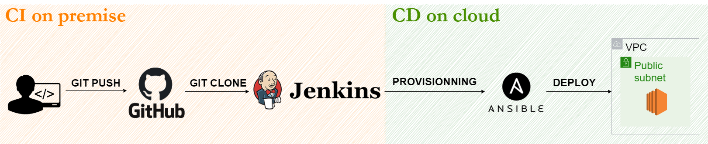

Le but de ce projet est de mettre en place une infrastructure pour déployer des applications python. Pour cela nous avons choisi une solution hybride, le build de l’application sera On Premise et le déploiement se déroulera dans le Cloud. Cette solution nous permet de gérer la confidentialité des données et limiter les coûts liés à l’infrastructure déjà disponible tout en gardant une haute praticité.

Pour cela, nous utiliserons des conteneurs tout au long de notre solution. Cette technologie permet de minimiser les soucis liés à l’infrastructure et d'optimiser l’efficacité et la rapidité d’usage des différents outils que nous utiliserons.
Parmi les outils que nous utiliserons figure Jenkins, un logiciel d’intégration continue qui permet de programmer des tâches selon des déclencheurs. Jenkins sera lié à Github, une solution de versionning, qui détectera chaque changement et qui ensuite lancera le build de l’application. Afin de vérifier si l’application est bien fonctionnelle, Jenkins sera connecté à Sonarqube, un logiciel permettant de mesurer la qualité du code. Si celui-ci présente des métriques acceptables, définis par les chefs de projet, alors un artefact sera créé et stocké dans Nexus. Nexus est un outil permettant la gestion des binaires et artefacts, il permet une distribution plus aisée de ceux-ci ainsi qu’un versioning.
Le déploiement de l’application se fera dans le Cloud via des instances EC2 d’AWS. Afin d’automatiser la mise à jour de l’application, un script Ansible s’occupera de récupérer la dernière version de l’artefact mis en ligne sur Nexus et le déploie sur les instances. Nous parlons bien d’instances au pluriel puisque nous utiliserons des instances de remplacement pour gérer le fail-over et donc la haute disponibilité du service. Cette haute disponibilité sera également assurée par un VPC, possédant plusieurs sous réseaux localisés dans différentes zones de disponibilité. Certains de ces sous-réseaux seront publiques et assignés aux instances EC2, tandis que des sous-réseaux privés seront créés afin de répondre aux besoins de confidentialité des données d’application, qui seront stockées sur une instance RDS. Ces instances sont surveillées directement sur la console AWS. 

Toutes les applications dépendantes de Jenkins auront une back up pour reprendre la main si la principale instance s’arrête. 

Toutes ces applications seront sécurisées par authentification avec différents niveaux de droits. Les comptes seront créés en fonction des besoins, des comptes admins possédant tous les droits ou bien des comptes de développeur leur permettant juste de gérer les projets auxquels ils sont assignés. 

Le but recherché est qu’une fois cette structure mise en place, la mise en production du service est le plus automatisée possible. 

Outils utilisés:
- github
- docker
- jenkins blue ocean
- sonarqube
- nexus sonatype
- ansible
- cloud AWS

Fonctionnement général:
- [SCM] jenkins récupère le projet sur github
- [BUILD] jenkins lance la compilation
- [TESTS] jenkins lance les tests unitaires/intégrations
- [CODE REVIEW] jenkins envoie le projet vers sonarqube (pour analyser la qualité du code)
- [STORE ARTEFACTS] jenkins stocke un artefact sur nexus
- [PROVISIONING] jenkins lance le script (playbook.yml) ansible
- [DEPLOY] ansible récupère et envoie l’artefact vers le cloud + prépare l’environnement du cloud 

Scripts à faire :
- docker-compose → lancer Jenkins, Sonarqube, Nexus
- Jenkinsfile → cloner le repo github, lancer les tests, analyser le code (SonarQube), stocker l'artefact (Nexus)
- playbook.yml → creer une instance EC2, récupérer l'artefact sur nexus, préparer l’environnement de déploiement, envoyer l’artefact vers le cloud, lancer l'application

Scénario de test:
 - Tout ce passe bien
 - Introduire des erreurs dans le code → artefact non généré 

# Setup

## Docker

Installer docker https://docs.docker.com/get-docker/

git clone https://github.com/Kinamori/projet-poei.git \
cd projet-poei \
mkdir jenkins-data/ nexus-data/ sonarqube/

docker-compose up -d

docker ps devrait afficher 
CONTAINER ID   IMAGE                 COMMAND                  CREATED         STATUS         PORTS                                                  NAMES \
e07b354b0302   jenkinsci/blueocean   "/sbin/tini -- /usr/…"   3 seconds ago   Up 2 seconds   0.0.0.0:8080->8080/tcp, :::8080->8080/tcp, 50000/tcp   jenkins \
a85779621db3   sonarqube             "bin/run.sh bin/sona…"   4 seconds ago   Up 3 seconds   0.0.0.0:9000->9000/tcp, :::9000->9000/tcp              sonarqube \
7a6a21b6f89c   sonatype/nexus3       "sh -c ${SONATYPE_DI…"   4 seconds ago   Up 3 seconds   0.0.0.0:8081->8081/tcp, :::8081->8081/tcp              nexus

SI CA FONCTIONNE ? \
ifconfig ou ipconfig \
en0 ou enp0 ou eth0 \
Copier son addresse ip \
ADRESSE IP UNIQUE POUR LES 2 CONFIGURATIONS \

SI CA FONCTIONNE PAS (virtual machine ?) \
copier l'ip du conteneur jenkins \
docker inspect -f '{{range .NetworkSettings.Networks}}{{.IPAddress}}{{end}}' jenkins \
copier l'ip du conteneur sonarqube \
docker inspect -f '{{range .NetworkSettings.Networks}}{{.IPAddress}}{{end}}' sonarqube \
copier l'ip du conteneur nexus \
docker inspect -f '{{range .NetworkSettings.Networks}}{{.IPAddress}}{{end}}' nexus 

## Jenkins 

### Connexion
docker exec -it jenkins cat /var/jenkins_home/secrets/initialAdminPassword \
Rentrer le mot de passe dans localhost:8080 \
Installer les plugins suggérés \
Créer un administrateur admin admin \
Laisser l'URL d'instance par défaut (localhost:8080) \
Start using Jenkins \
Manage Jenkins -> Manage Plugin -> Available -> SonarQube Scanner -> install without restart \
docker restart jenkins \
Actualiser la page, se connecter avec le compte admin créer plus tôt
Lancer le conteneur Jenkins en tant que root pour installer les différents outils à utiliser: 
> docker exec -it --user root jenkins sh
> apk add python3 (installer python3)
> apk add py3-pip (installer pip3)
> pip3 install pytest (installer pytest)
> pip3 install ansible (installer ansible version 2.10)

### Plugin Sonarqube
Docker jenkins cd /var/jenkins_home \
wget https://binaries.sonarsource.com/Distribution/sonar-scanner-cli/sonar-scanner-cli-3.3.0.1492-linux.zip \
unzip sonar-scanner-cli-3.3.0.1492-linux.zip \
Manage Jenkins -> Configure Global Tool -> Sonarqube Scanner \
Name : Sonarqube scanner \
Uncheck install automatically \
PATH : /var/jenkins_home/sonar-scanner-3.3.0.1492-linux \
Save 

Manage Jenkins -> Configure System -> SonarQube servers \
Name : Sonarqube \
server URL : http://<my-sonarqube-ip>:9000 \
Server authentication token -> add \
Kind : Secret text \
Secret : [le token copier lors de la configuration de sonarqube](#Token) \
id: token sonarqube \
Save 

### Plugin Git Integration
(Ne fonctionne pas si on n'a pas accès aux urls avec l'adresse ip) \
Pour build après chaque commit \
Jenkins -> Manage Jenkins -> Manage Plugin -> Github Integration -> install without restart \
Restart jenkins 

### Creation d'un item
Jenkins \
New Item -> Pipeline project \
Name : projet_pipeline \
Pipeline -> definition : Pipeline Script from SCM \
SCM : Git \
Repository URL : https://github.com/Kinamori/projet-poei.git \
Branches to build -> Branch Specifier : */main \
Script Path : flask-pytest-example-master/Jenkinsfile \
SAVE

## Sonarqube

localhost:9000 admin admin par défaut \
Changer de mot de passe 

### Webhook
Administration -> Configuration -> webhook \
Creer un nouveau webhook \
name : Sonarqube \
URL : http://<my-jenkins-ip>:8080/sonarqube-webhook \
Create

### Token
Administrator -> my account -> security \
jenkins puis generate token \
Copier le token créé \
Dans mon cas 933f34d817d7ef4b8b87944525c17b02c74d3743

Sonarqube -> create new project \
project key : projet \
OK \
Provide token -> use existing token -> le nom du token créé plus tôt \
OK \
Other -> Linux

## Nexus
docker exec -it nexus cat /nexus-data/admin.password \
Copier le mot de passe affiché 7e5325aa-959b-4961-8568-17d9d3285721 \
Sign in admin le mot de passe récupéré plus haut \
new password root \
Enable anonymous access \
FINISH

Icone paramètre -> Repositories -> create repository -> raw (hosted) \
Name : projet_pipeline \
CREATE REPOSITORY

## Github
Dans le projet github -> settings -> webhooks -> add new webhook \
Payload URL : http://<my-jenkins-ip>:8080/github-webhook \
Content type : json \
Check Just push event \
Check Active

